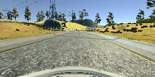
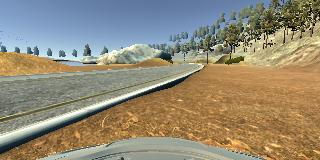
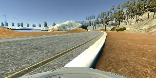
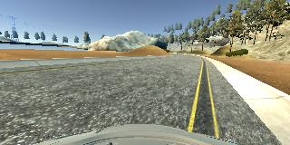
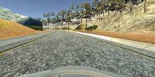
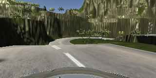

# **Behavioral Cloning** 

## Writeup Template

### You can use this file as a template for your writeup if you want to submit it as a markdown file, but feel free to use some other method and submit a pdf if you prefer.

---

**Behavioral Cloning Project**

The goals / steps of this project are the following:
* Use the simulator to collect data of good driving behavior
* Build, a convolution neural network in Keras that predicts steering angles from images
* Train and validate the model with a training and validation set
* Test that the model successfully drives around track one without leaving the road
* Summarize the results with a written report


[//]: # (Image References)

[image1]: ./examples/placeholder.png "Model Visualization"
[image2]: ./examples/placeholder.png "Grayscaling"
[image3]: ./examples/placeholder_small.png "Recovery Image"
[image4]: ./examples/placeholder_small.png "Recovery Image"
[image5]: ./examples/placeholder_small.png "Recovery Image"
[image6]: ./examples/placeholder_small.png "Normal Image"
[image7]: ./examples/placeholder_small.png "Flipped Image"

## Rubric Points
### Here I will consider the [rubric points](https://review.udacity.com/#!/rubrics/432/view) individually and describe how I addressed each point in my implementation.  

---
### Files Submitted & Code Quality

#### 1. Submission includes all required files and can be used to run the simulator in autonomous mode

My project includes the following files:
* model.py containing the script to create and train the model
* drive.py for driving the car in autonomous mode
* model.h5 containing a trained convolution neural network 
* writeup_report.md or writeup_report.pdf summarizing the results

#### 2. Submission includes functional code
Using the Udacity provided simulator and my drive.py file, the car can be driven autonomously around the track by executing 
```sh
python drive.py model.h5
```

#### 3. Submission code is usable and readable

The model.py file contains the code for training and saving the convolution neural network. The file shows the pipeline I used for training and validating the model, and it contains comments to explain how the code works.

### Model Architecture and Training Strategy

#### 1. An appropriate model architecture has been employed

My model mimics the NVIDIA architecture shown in the lectures, using 5x5 and 3x3 filters with depths ranging from 24 to 64.

My model uses RELU layers to introduce nonlinearity. The images are cropped and normalized to include only relevant driving data and reduce variation.

#### 2. Attempts to reduce overfitting in the model

The model contains two dropout layers before the first two fully connected layers. Each has a dropout probability of 0.5. This allowed my vehicle to navigate around the first track. Before including dropout, my car would veer off of the road at the second left turn when it encountered the dirt path.

#### 3. Model parameter tuning

The model used an adam optimizer, so the learning rate was not tuned manually (model.py lines 102-103).

#### 4. Appropriate training data

My training data contained several components. I first included two laps of driving on the first track. I then spent time adding video segments which started off road and returned to the center to help with recovery, still on the first track. Finally I added a full lap of focused center driving from the challenge track. 

I augmented all of this by using left and right images, along with each of these images flipped over their vertical axis. The steering measurement was made negative for these flipped images, with 0.15 used as a correction for left and right image steering angles.  

For details about how I created the training data, see the next section. 

### Model Architecture and Training Strategy

#### 1. Solution Design Approach

The overall strategy for deriving a model architecture was to use transfer learning as a starting point and improve the model using my judgement of its performance on the track.

My first step was to use a convolution neural network model similar to the NVIDIA architecture seen in the lectures and suggested all over Slack. I thought this model might be appropriate because it was used for the same task before and isn’t overly complex.

In order to gauge how well the model was working, I split my image and steering angle data into a training and validation set. My model made sharp left and right turns as it attempted to move straight down the initial stretch of road. After some research I found that many on Slack recommended switching to mean absolute error (mae). While mean squared error (mse) heavily penalizes outliers in the data (like making a single sharp turn to return to the center of the road), mae seems to allow for a smoother ride because these outliers are not punished so severely. 

At this point, I still noticed that my model couldn’t complete the first turn. I then included cropping and normalization, as I was using raw pixel image at first. I completed the first turn with this, but was left off-roading during the second turn.

Finally, I added dropout before the first two fully connected layers. I thought that this turn may have been underrepresented and the learning process may have ignored it for easier to learn features. Dropout didn’t allow it to consistently rely on those features and forced the model to learn how to navigate the turn near the dirt path.

At the end of the process, the vehicle is able to drive autonomously around the track without leaving the road.

#### 2. Final Model Architecture

The final model architecture (model.py lines 79-100) consisted of a convolution neural network with the following layers and layer sizes:

* Lambda layer - normalizes the image
* Cropping layer - hones in on relevant parts of the image (excludes the sky and hood of the vehicle)

* Convolutional layer - 5x5 filter with a depth of 24, stride of 2 and a RELU activation
* Convolutional layer - 5x5 filter with a depth of 36, stride of 2 and a RELU activation
* Convolutional layer - 3x3 filter with a depth of 48, stride of 2 and a RELU activation
* Convolutional layer - 3x3 filter with a depth of 64, no stride and a RELU activation
* Convolutional layer - 3x3 filter with a depth of 64, no stride and a RELU activation

* Flattening layer - create a 1 dimensional array from the 2 dimensional data
* Dropout layer - probability of 0.5
* Fully connected layer - 100 nodes
* Dropout layer - probability of 0.5
* Fully connected layer - 50 nodes
* Fully connected layer - 10 nodes
* Fully connected layer - 1 node (output node representing steering angle)


#### 3. Creation of the Training Set & Training Process

To capture good driving behavior, I first recorded two laps on track one using center lane driving. Here is an example image of center lane driving:



I then recorded the vehicle recovering from the left side and right sides of the road back to center so that the vehicle would learn to get back on track if it ever found itself off off-roading. These images show what a recovery looks like starting from the dirt road on the first track:






Then I repeated this process on track two in order to get more data points.

To augment the data sat, I also flipped images and angles thinking that this would provide more examples of right turns, since the first track contains primarily left turns. For example, here is an image that has then been flipped:




After the collection process, I had 14121 number of data points. This includes the left, right and center images. Including the flipped images, I had 28242 total data points. I then preprocessed this data by cropping and normalizing it within the pipeline so that new images would be preprocessed in the same way.


I finally randomly shuffled the data set and put 20% of the data into a validation set. 

I used this training data for training the model. The validation set helped determine if the model was over or under fitting. The ideal number of epochs was 20 as evidenced by the consistent falling of both the training and validation loss until the 19th epoch. I used an adam optimizer so that manually training the learning rate wasn't necessary.
